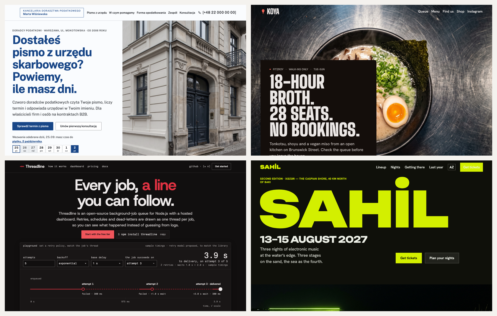
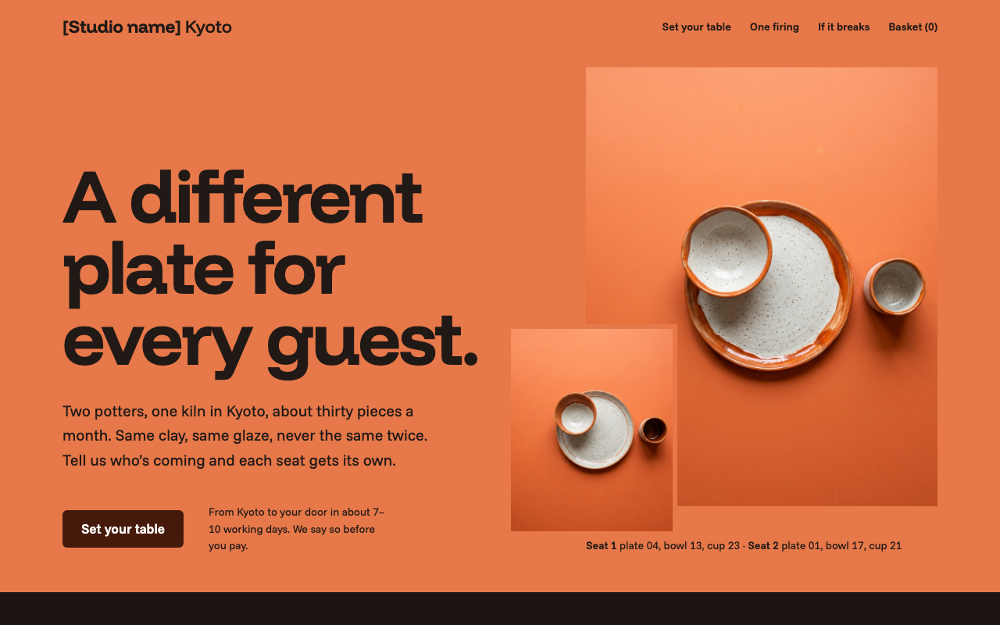
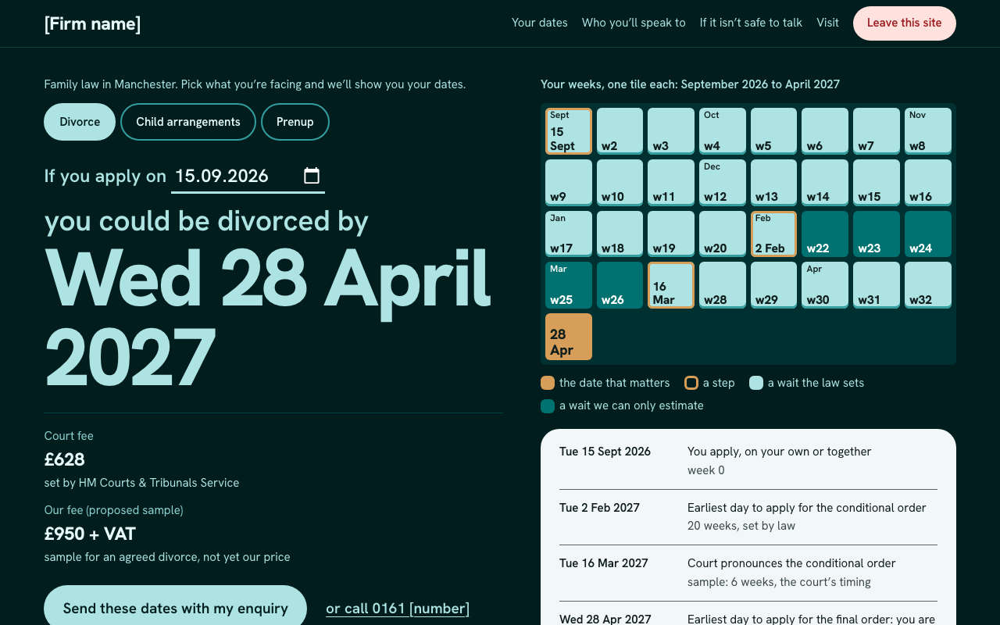
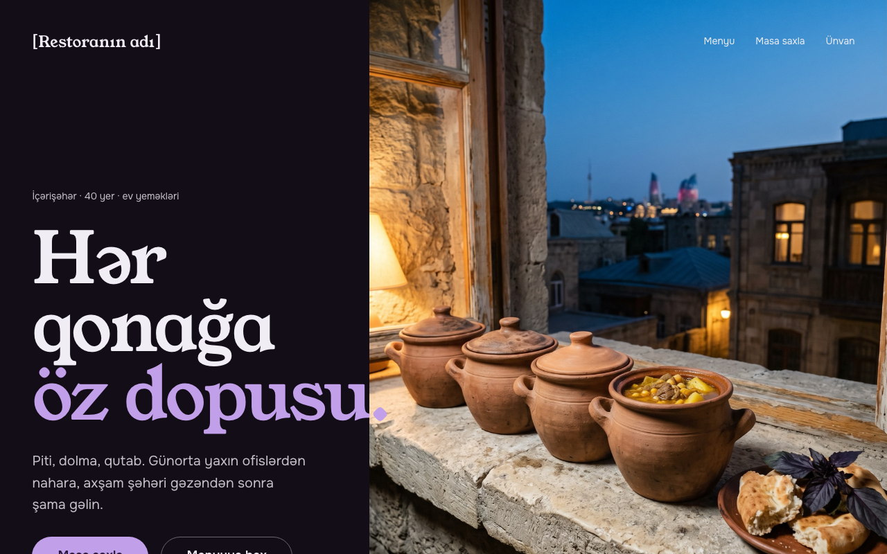
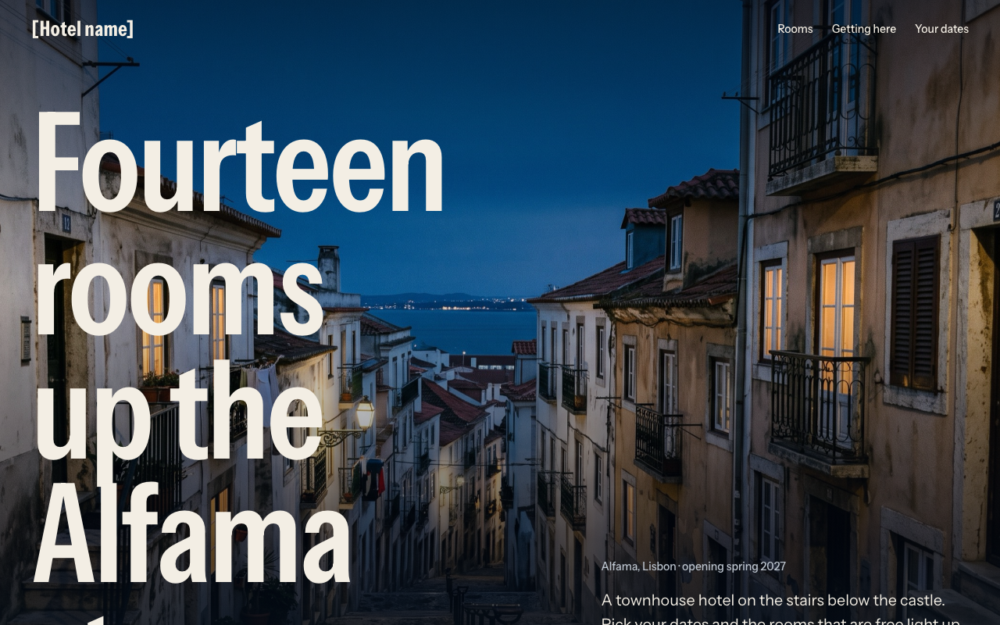
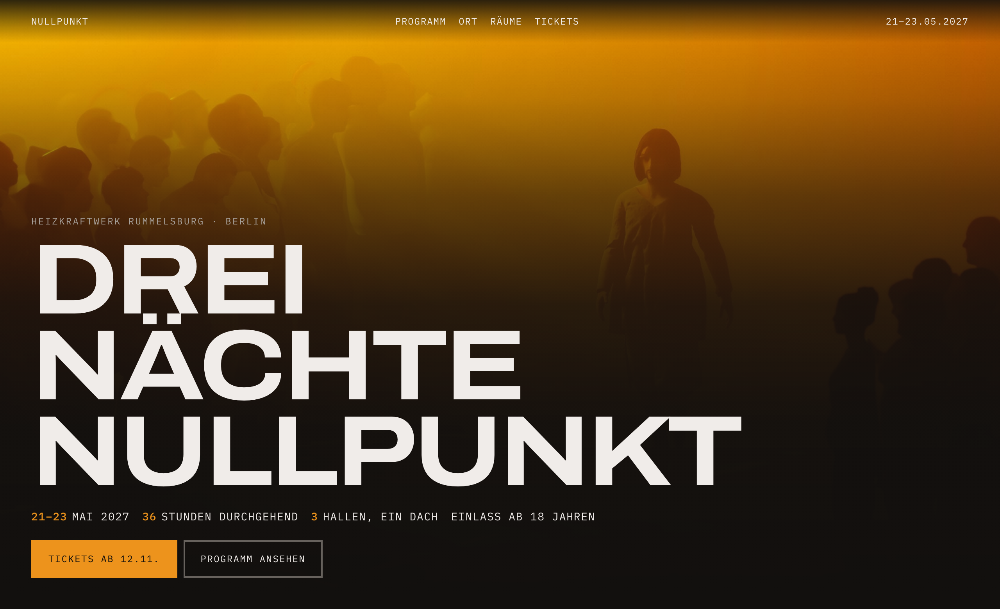
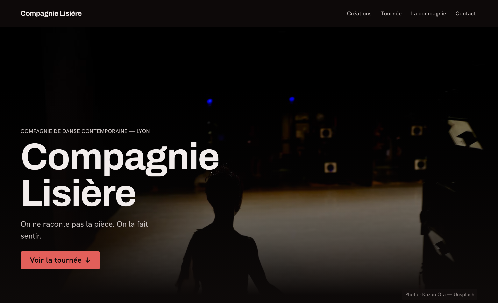
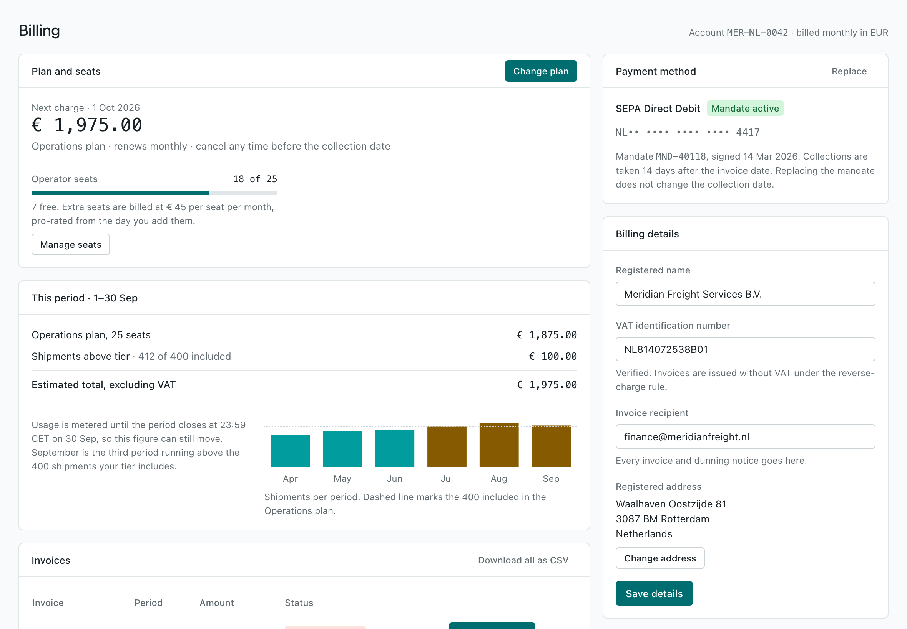
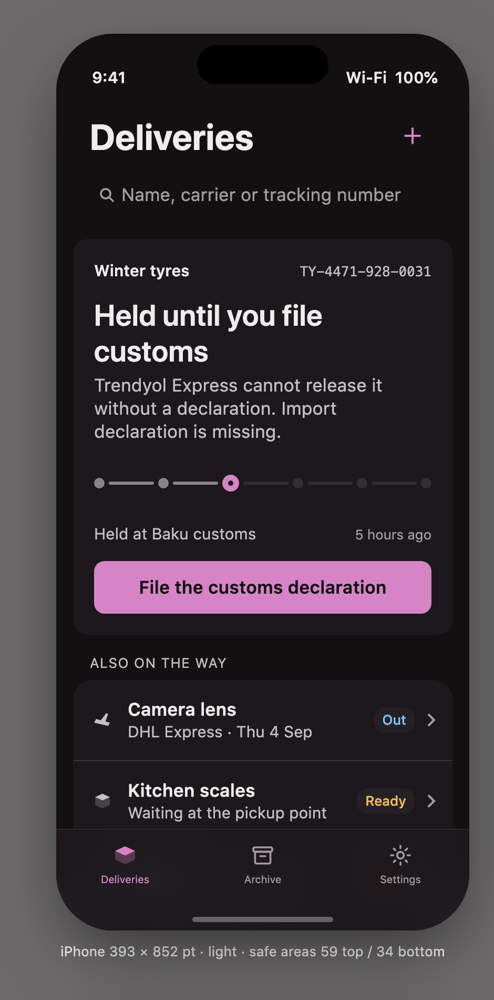

<picture>
  <source media="(prefers-color-scheme: dark)" srcset="docs/images/banner-dark.png">
  
</picture>

# no-slop-design

A design skill for coding agents. It researches before it draws, builds a direction from real references, sets its
own design tokens, respects the platform it ships on, checks its work against its own recent pages so it does not
repeat itself, and scores the result honestly before handing it over.

Works in Claude Code as a skill or a plugin, and in any agent that reads the [Agent Skills](https://agentskills.io)
`SKILL.md` format — Codex, Cursor, Copilot, OpenClaw.

[](https://github.com/agshinrajabov/no-slop-design/actions/workflows/ci.yml)


---

## The problem it solves

Slop is not a style. It is what happens when a visual decision is **not made**: the default font, the purple
gradient, the three icon cards, the fade-up on every section, the "Unlock the power of…" headline. Models converge
on the median of every Tailwind tutorial ever scraped, so four different businesses come back as the same page.

Every decision in this skill answers one question:

> **Was this chosen, or did it happen?**

If you cannot name the brand attribute, the content type, or the user need behind a choice, it is slop, and it gets
replaced by a decision. That applies to the over-corrections too — brutalism for no reason, mono everywhere, an
editorial serif costume, a page of restrained tables with no imagery — and to the skill's own habits, which it
measures and breaks.

## Install

```bash
claude plugin marketplace add agshinrajabov/no-slop-design
```

```bash
claude plugin install no-slop-design@no-slop-design
```

As a plain skill, or for a non-Claude agent, clone it where your agent loads skills from:

```bash
git clone https://github.com/agshinrajabov/no-slop-design ~/.claude/skills/no-slop-design
```

To try it without installing: `claude --plugin-dir ./no-slop-design`. The scripts need Python 3.9+ and nothing else;
the review renders use a local Chrome, Chromium or Edge.

## Use it

Ask for design work in your own words. The skill triggers on requests like *"design a website for our restaurant,
with table booking"*, *"this landing page looks AI-generated, fix it"*, *"redesign our pricing page, keep our brand
colour and font"*, *"add a settings page in our existing design system"*, *"review this screen"*.

The intake asks four things before anything is drawn, and decides them itself if you are not around:

| | Why it comes first |
|---|---|
| **Market and language** | The page is written in the market's primary language. A Baku restaurant is not an English page with "AZ to follow"; research combines the local market's leading products with worldwide references. |
| **Existing or preferred design system** | A Figma library, Storybook, tokens file or brand guide is adopted, not replaced. A font or colour your brand fixed is used well, not graded down. |
| **The memorable thing** | One sentence that every later decision serves. "Clean and modern" gets pushed back on, once. |
| **Expression register** | How much visual ambition the work carries, and what that costs — argued from the brief, never from what recent projects did. |

## The two axes

The **register** decides how loud a page looks. It stops a festival and a dental clinic from coming out the same.

| | **R1 Utility** | **R2 Composed** | **R3 Expressive** | **R4 Experimental** |
|---|---|---|---|---|
| For | tools, dashboards, docs | services, B2B, most marketing | hospitality, fashion, culture, brand sites | festivals, portfolios, launches |
| Reads as | dense, calm, no hero | a poster page with one bold move | full-bleed art direction, big type, a signature moment | bespoke navigation, scroll narrative, WebGL |
| Effort | 1× | 1.5× | 3–5× | 8–20× |
| Fails as | a wall of rows | a template | a mood board with a button | a demo nobody can use |

**Interaction depth** decides how much the visitor can do. Every persuasive page ships one signature interaction that
performs the visitor's real job and carries its answer into the next step — seats dealt piece by piece for a
ceramics shop, a wall of weeks to a divorce date for a law firm, a clay pot per guest in a restaurant booking. When
price or time is the question, the answer shows real numbers from labelled sample rates, never `[n]`.

Registers are not quality levels. Above R1, every first viewport — on the desktop *and* on the phone — still carries
one bold move: poster-scale type, a dominant photograph or drawing, or a saturated colour field.

## What it actually does

| Phase | What happens | Artefact |
|---|---|---|
| 0 Detect | Classifies the request; finds any existing design system, brand or tokens; reads what recent projects looked like; baselines the current UI with the linter | findings |
| 1 Brief | The four intake questions plus product, user, top job, constraints; surface mode, register, interaction depth, signature interaction, primary language | `design/brief.md` |
| 2 Research | Local **and** global: job stories, competitor first screens, review mining, a heuristic pass; every insight ends in a decision | in `DESIGN.md` · Deep: `research.md` |
| 3 Direction | Real annotated references → a remix thesis → the anchor and imagery art direction → one direction plus an alternative; registered with `design_log.py plan` so repeats and runs in parallel are caught before building | in `DESIGN.md` |
| 4 System | OKLCH colour, fluid type — and the structural scales (spacing rhythm, radius family, control height, borders, motion) set from the direction, not inherited from the starter | `tokens/`, `build/` |
| 5 Compose | A bold move in the first viewport, sections derived from the content, a result with a designed form, people shown as people, unstated services marked as proposals | screen composition |
| 6 Build | A working prototype at three widths with real or clearly labelled content — or your framework, or SwiftUI/Compose | working UI |
| 7 Review | `shoot.py` renders and measures; `slop_lint.py` grades; the gates; then **the studio crit**: the page beside the best earlier pages, scored on six axes and revised toward A+ | review of record in `DESIGN.md` |
| 8 Hand off | Deliverables, specs, shot list, proposals to confirm, decision records | handoff package |

Two modes. **Standard** (default) targets 10–15 minutes at R1–R2 and 20–25 at R3, plus about five minutes when the
crit sends an idea back to be rebuilt. **Deep** runs two or three directions and up to three crit passes.

## How it speaks the market's language

Twenty-one releases made pages differ from each other, and they still read as one studio's work across industries,
because the skill had one design language and every rule was written in it. A page now takes its language from its
category, measured, not from the skill:

```
python3 scripts/shoot.py --profile https://local-competitor.az https://second-local.az https://global-leader.com
  light;low;serif;medium;soft;photo;left;functional;solid     https://local-competitor.az
  …
market   light;low;serif;medium;soft;photo;left;functional;solid
  split  density: medium ×2, airy ×1
```

Nine axes with a closed vocabulary — surface, chroma, type, density, radius, imagery, layout, motion, controls —
measured from the competitors' first screens. The page is written in that language and departs from it only where the
brief pays for it, one or two named axes. Brutalism, mono, the dark developer tool, the neutral component library, the
dense utility page are languages, not slop; the linter reads the declared language and stops flagging its native
devices. What stays slop in every language is the default nobody chose. `references/design-language.md` has the
axes, the method and six calibration points that are deliberately not a menu.

## How it keeps pages different

Rules alone did not stop pages from converging: each fix produced a new habit. So the skill measures what a page
*is* and compares it with its recent pages in `~/.no-slop-design/history.json`.

| Measured by `shoot.py` or recorded from a closed vocabulary | Warns when |
|---|---|
| Surface polarity, from the pixels, in an explicit colour scheme | two pages in a row share it |
| First-viewport composition (`graphic-hero`, `result-poster`, `type-poster`, …) and display type scale | the last two match, or a habit returns in three of the last six |
| Section skeleton and image count | two pages run the same sections in the same order, or three carry no image |
| The result's form (`figure`, `diagram`, `calendar`, `map`, `paper`, …) | the same answer shape repeats |
| Image look (angle · light · surface · palette) | generated or stock photos share the image model's default look |
| UI dialect (control shape · dividers · labels · section headers · display face) | two businesses draw their components the same way |
| Runs in progress on the same machine | two parallel runs react to the same history the same way |
| Design language (nine axes) and the market fingerprint | two unrelated industries share a language; one language fills three of the last six pages; a page departs from its market on four or more axes |

Every warning is written into the project. It is either acted on or answered with a reason in `DESIGN.md` — the
linter checks — never ignored.

## How it judges quality

Passing every rule is not the bar. `crit_board.py` pins the page's desktop and phone first screens beside the
best-scored earlier pages and the best and latest page for the same industry, and the page is scored 1–5 on six axes:

| Idea | Memorability | Imagery & craft | Type & rhythm | Completeness | Interaction |
|---|---|---|---|---|---|
| only this business could have it | describable after three seconds | finished, art-directed | clear pairing, varied pace | no `[…]` where writing was possible | a designed answer that carries on |

**A+** is every axis ≥ 4, a total of 26 or more, and not weaker than the best page on the board on idea or
memorability. Below that the two weakest axes are revised; an idea below 4 is rebuilt, not polished. The score is
reported as it is. In testing, agents consistently scored themselves the way a reviewer did — 23, 24, 26 — rather
than rounding up.

## What it refuses

A catalog of roughly 100 tells across colour, type, layout, components, iconography, copy, motion, imagery,
accessibility and process. 63 of the mechanical ones are checked by the linter, some of them across files. A few:

- purple/indigo gradients, gradient text, glow blobs, an accent imported from outside the brand hue
- the three-icon-card feature grid, the centred hero with a pill badge, cards inside cards, uniform bubbly radius
- Inter/Roboto/Poppins by reflex (unless your brand fixed them), Space Grotesk and the italic-serif-accent formula
- fabricated metrics, testimonials, logos, avatars — and invented services or guarantees written as fact
- auto-scrolling marquees, fade-up on every section, `transition: all`, removed focus outlines, reveals that leave
  the page blank when the script fails
- **the over-corrections**: text-only "honest" pages, the label-value ledger, grey placeholder boxes, photo-stuffing
- **and the skill's own habits**: the house skeleton (estimator → steps → price table → form), poster type on every
  page, results as receipts and letters, the image model's wooden-table photo, English by default, and the starter
  dialect — the template's spacing, radius and button sizes kept under a new colour

## What it produced

Real runs from short client briefs, with the agent told the client was unreachable. Unretouched. Photographs on
these pages are generated stand-ins, labelled on the page and in `assets.md` for the client to replace.

<details open>
<summary><b>A ceramics studio in Kyoto</b> — R3, the one A+ in testing (crit 26), 20 min</summary>



"A different plate for every guest." Thirty one-off pieces a month became the interaction: choose how many guests
and the page deals numbered pieces seat by seat, with the total at the door in the buyer's currency, import VAT and
an arrival window. Breakage gets its own section, marked as a proposal for the studio to confirm.
</details>

<details>
<summary><b>A family law practice in Manchester</b> — R2, crit 24, 18 min</summary>



"You could be divorced by Wed 28 April 2027": pick the matter and a date, and a wall of week-tiles shows the waits the
law sets apart from the waits only the court decides — 20 weeks, then six weeks and a day. Court fee, a labelled
sample fee, a "Leave this site" button, and a choice of safe times to be contacted.
</details>

<details>
<summary><b>A restaurant in Baku's Old City</b> — R3, in Azerbaijani, crit 24, 23 min</summary>



"Hər qonağa öz dopusu" — every guest their own clay pot. The booking counts pots: each guest's pot fills when they
choose piti, and the order goes out as a ready-written WhatsApp message. Lunch and evening are two halves of the
same room; English lines sit under the dishes for evening tourists.
</details>

<details>
<summary><b>A boutique hotel in Lisbon's Alfama</b> — R3, crit 27, 18 min</summary>



"Fourteen rooms up the Alfama steps." The availability check is a drawing of the house: pick dates and guests and the
free rooms light up, each with its total including city tax. The stairs are named plainly, with an "arriving with
suitcases" section.
</details>

<details>
<summary>Earlier runs (1.3–1.4): a Berlin festival, a Lyon dance company, a billing page in an existing system, an iOS tracker</summary>






The billing run adopted a mature design system unchanged and found a real WCAG failure in its host app (white on the
action colour at 4.35:1). The iOS run kept all chrome native and put the ambition into the states nobody designs.
</details>

## Tools

Stdlib Python, no installs. The skill runs these itself; you can run them on any project.

| | |
|---|---|
| `slop_lint.py <path>` | Scans HTML, CSS, JSX/TSX, Vue, Svelte, Dart, Swift and Kotlin for slop signatures, the skill's own habits, unanswered warnings, unmarked proposals and unfinished copy, and prints a grade with the catalog section to read. `--json`, `--strict` for CI. |
| `shoot.py <page>` | The review renders in one command with headless Chrome in an explicit colour scheme: desktop and 375 px pages, a JavaScript-disabled page, the 375 px editing test (`--set "#pages=12"`), scroll containers, the bold move on desktop and phone, and the composition, skeleton, UI-dialect and design-language fingerprints. Writes outside your project. |
| `shoot.py --profile <urls>` | The market fingerprint: each competitor page measured on the nine axes (fetched with scripts off and reveal states forced; every render named so it can be checked by eye) and the most common word per axis with the splits. |
| `crit_board.py <page>` | The studio crit: your page's first screens beside the best-scored earlier pages and the best and latest for the same industry, rendered to one image to look at before scoring. |
| `design_log.py` | Cross-project memory. `plan` registers a direction before building (runs in parallel see each other), `add` records the finished page with its measured fingerprints, language, market line and crit score, `check` warns about repeats and about a language shared across industries or far from its market, and `--record` writes the warnings into the project. |
| `build_tokens.py` | Compiles W3C DTCG tokens (aliases, `*.dark.json` modes) to CSS custom properties, Tailwind v4 `@theme`, SwiftUI, Compose, Flutter and flat JSON. `--check` validates and runs a palette sanity check. |
| `contrast.py` | WCAG 2.x and APCA for a pair, a pairs file, or every text role on every surface role in every mode. Exit 1 on an AA failure. |
| `type_scale.py` | Fluid modular type scale with line-height and tracking per step. |
| `audit_repo.py`, `selftest.py` | Maintainer tools, run in CI: the docs, templates and scripts must describe the same skill, and every rule must still fire on its fixture (129 checks). |

## Layout

```
SKILL.md          the router: what to do, and which reference to read at that step
references/       24 deep references, loaded per phase, never all at once
  discovery · existing-design-system · mini-user-research · moodboard · inspiration-sources
  expression-register · interaction-depth · design-language · visual-material · anti-slop · design-tokens · color · typography
  spacing-layout · components · ux-patterns · content-microcopy · motion · accessibility
  web-frontend · mobile-ios · mobile-android · review-checklist · handoff
templates/        brief · DESIGN.md · assets.md · DTCG token starter (names, not a style) · contrast pairs · design log
scripts/          the tools above
evals/            six scenarios with rubrics, plus the fixtures the linter is tested against
```

`SKILL.md` stays a router under 500 lines; the depth lives in `references/` and loads only when a phase needs it.

## Where it stands

Across 21 releases, each driven by running the skill and looking at the screenshots, pages went from four businesses
sharing one dark, text-only template to pages that differ by industry in idea, colour, type, components, imagery and
interaction. Typical results score A− (24–25 of 30) on the studio crit; one run reached A+. The remaining distance is
mostly material: real photographs, a real brand and a real brief move a page further than another rule would.

## How it compares

Other design skills cover a slice: taste briefings with no workflow, style databases that still recommend
glassmorphism, browser-audit monoliths with heavy dependencies, anti-slop catalogs with no research or tokens,
token pipelines with no aesthetic opinion, UX method libraries with no visual opinion. The bet here is that slop is
a **process** failure — including the process's own habits — so the fix is the whole process with measurement:
research, direction, tokens, composition, review, comparison and an honest score, for web and native, inside an
existing system or from scratch.

## What the field tests broke

<details>
<summary>Each version came from running the skill and looking at the screenshots. 21 releases, one line each.</summary>

| | Found by | Fixed |
|---|---|---|
| 1.1 | Three briefs (dental, coffee, law) produced the same dark, serif, table-shaped page with no images | `visual-material.md`, market and design-system intake, local references |
| 1.2 | A competent page that still read as a document | `expression-register.md`, the photograph three-match test, an accent-hue check |
| 1.3 | A self-audit: the 1.2 rules were in `SKILL.md` but not in the templates | `audit_repo.py`, `selftest.py`, CI, cross-project memory |
| 1.4 | An existing system, an iOS screen, and eval 04 on a weaker model | OKLCH silently dropped from the native token output, page rules judging component source, the unchecked marquee, register-aware budgets |
| 1.5 | Real use: the skill reached for photographs by reflex, because 1.1 had turned "no images" into an image quota | the direction decides the anchor type; image rules read that decision instead of counting images; photo-stuffing is a tell |
| 1.6 | A B+ translation-agency page that was all type and no interaction: the register had quietly capped interaction for every service business | `interaction-depth.md` as a separate axis; one signature interaction per persuasive page; explanatory scroll sequences allowed at R2; the cross-project log warns after two same-surface runs |
| 1.7 | The 1.6 rerun worked but its surface polarity was only ever declared, never measured; its mobile result scrolled out of view; unchecked radios looked checked; a price column was clipped | surface polarity measured from screenshots; a 375 px result-visibility check and lint rule; native-control and narrow-table rules; honest deltas and market-locale numbers |
| 1.8 | The 1.7 rerun fixed every finding and lost the design, and spent a third of its time building a screenshot harness it left in the project | `shoot.py`; the interaction must not replace the direction; reruns compared with the run before; lint for tables-as-sections, scroll tables without a cue, and review scaffolding |
| 1.9 | The best run yet was in English for a Baku agency, and moved to R3 because the history log counted the register as an axis to break; every screenshot followed the Mac's dark mode | pages in the market's primary language; the register comes from the brief only; renders use an explicit colour scheme |
| 1.10 | The 1.9 rerun was right on every rule and forgettable: R2 had been read as "nothing loud" | every first viewport above R1 carries one bold move, measured against the register's floor |
| 1.11 | The seal-diagram run: best idea yet, but `[n]` days and no price, a graphic below the inputs on phones, no brief | labelled sample rates; the phone's first screen needs its own bold move; the Standard design record is enforced |
| 1.12 | The first clinic run looked like the last translation run: an answer set huge on a colour field | first-viewport composition named and compared across industries; a result above the inputs counts as on screen |
| 1.13 | Six pages, one skeleton: interaction → steps → price table → form, no image — the rules had become a template | section skeleton and image count measured and compared; the template named as a tell; "no assets" no longer means no images |
| 1.14 | Four varied prompts shared habits: results as receipts and letters, the interaction under the hero, portraits as colour boxes, parallel runs blind to each other | named result forms, opening/closing checks, `design_log.py plan`, people placeholders, brand-fixed fonts respected |
| 1.15 | Five first viewports in a row on poster-scale type; generated photos in the image model's wooden-table look | plans require composition and result form; type scale and image look compared |
| 1.16 | Two photo sets both top-down on pale stone, described in words that never matched | image look recorded from a fixed vocabulary and compared facet by facet |
| 1.17 | A run read a convergence warning and kept the repeat "deliberately"; menu photos graded against a diagram anchor | warnings written into the project and answered in writing (linted); menu, product and gallery photos count as content |
| 1.18 | A re-plan warned a run against its own plan; a shop promised a signed box the studio never offered | a plan replaces its own; unstated services and guarantees marked as proposals |
| 1.19 | Two parallel runs read the same warning and both went dark; poster type came back two rounds later | runs in progress compared with each other; habits counted over six runs; plans identified by folder |
| 1.20 | Every check passed and a restaurant page still got worse | Gate 14 studio crit on a rendered board of the best earlier pages; unfinished copy flagged |
| 1.21 | Pages still read as one studio's work: 39–41 of 41 structural token values were the template's own | structural scales set from the direction and linted; UI dialect measured and compared; best page per industry on the board; weak ideas rebuilt |
| 1.22 | Ten industries still half alike: the skill had one design language and every rule, floor and lint was written in it; genres outside it were listed as slop | the design language as a measured nine-axis profile taken from the category's own pages (`shoot.py --profile`); rules and lint read relative to it; convergence judged by language across industries and by distance from the market |

Full detail in [CHANGELOG.md](CHANGELOG.md).
</details>

## Contributing

Issues and pull requests are welcome, especially new tells for the catalog (with a source or a screenshot), false
positives in the linter, platform updates as the HIG and Material change, and eval scenarios that expose weak
spots. Run `python3 scripts/selftest.py` and `python3 scripts/audit_repo.py` before opening a PR; CI runs both.
Keep additions in the existing style: dense, numeric, tables over prose, no marketing language.

See [CONTRIBUTING.md](CONTRIBUTING.md).

## Licence

MIT. See [LICENSE](LICENSE).
