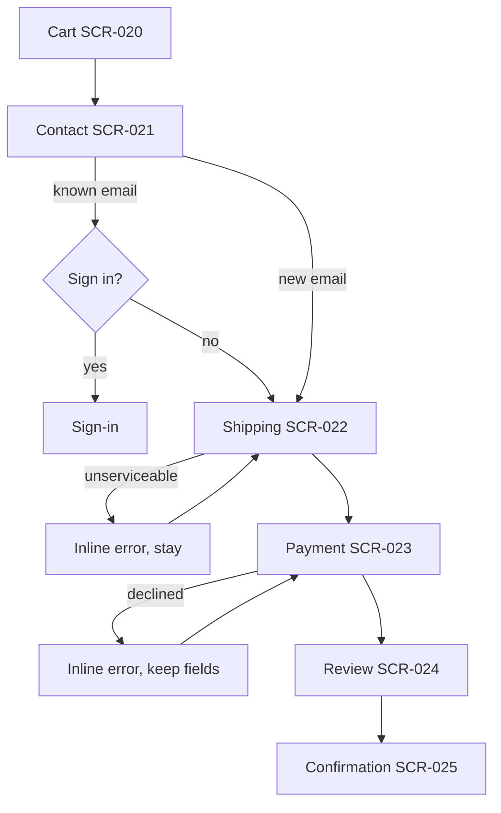

# Handoff

How design work leaves the agent and reaches engineering, a human designer or a stakeholder without loss. Covers what to deliver per engagement type, the screen and flow spec templates, token-based annotation instead of pixel redlines, the Figma workflow (Variables, Dev Mode, Code Connect, DTCG import/export), a prototype fidelity ladder, a 30-item engineering checklist, design QA after build, documentation hygiene including design decision records, and how to present options to non-designers. Token structure is defined in `design-tokens.md`; acceptance criteria for visuals reference `color.md`, `typography.md`, `spacing-layout.md`, `components.md`, `motion.md`, `accessibility.md`; web implementation details in `web-frontend.md`; platform specifics in `mobile-ios.md` and `mobile-android.md`.

## Contents

1. Deliverables by engagement type
2. Screen spec template
3. Flow documentation
4. Annotations without redlines
5. Figma workflow
6. Prototype fidelity ladder
7. Engineering handoff checklist (30 items)
8. Design QA after build
9. Documentation hygiene
10. Working with non-designers and stakeholders
11. Sources

## 1. Deliverables by engagement type

| Deliverable | New product | New feature | Redesign | Design system only |
|---|---|---|---|---|
| `DESIGN.md` (attributes, decisions, changelog) | Required | Update | Required | Required |
| `tokens/*.json` (DTCG) + `build/` outputs | Required | Only if tokens change | Required | Required |
| `moodboard.html` | Required | No | Required | Optional |
| `research-synthesis.md` | Required | If research ran | Required | Optional |
| Screen specs (`specs/screens/*.md`) | Every screen | Changed screens | Every screen | Reference screens only |
| Component specs (`specs/components/*.md`) | New components | New or changed | All in scope | All |
| Flows (`specs/flows/*.md`, Mermaid) | Core flows | The flow touched | Core flows | No |
| Prototype (HTML or Figma) | Hi-fi HTML | HTML of changed screens | Hi-fi HTML | Component demo page |
| `review-report.md` (self-review against `anti-slop.md`, `accessibility.md`) | Required | Required | Required | Required |
| `contrast-pairs.txt` | Required | If colours change | Required | Required |
| `design-log.json` (timestamped decisions, sources, rejected options) | Required | Required | Required | Required |

File layout:

```
design/
  DESIGN.md
  design-log.json
  research-synthesis.md
  moodboard.html
  tokens/{primitive,semantic,component}.tokens.json
  build/{tokens.css,theme.css,tokens.swift,tokens.kt}
  specs/{screens,components,flows}/
  prototype/
  review-report.md
  contrast-pairs.txt
```

## 2. Screen spec template

One file per screen, ≤120 lines. Anything inferable from tokens plus component specs is omitted.

```markdown
# Screen: Orders list                       ID: SCR-014   Status: ready-for-build   Owner: design

### Purpose
Answer "which orders need my action today?" for warehouse staff. Surface mode: Operate.

### Entry points
Sidebar › Orders; deep link /orders?status=pending; notification "3 orders awaiting pick".

### Layout regions (desktop ≥ breakpoint.sidebar)
- Header: title, count, primary action "New order", search (component: PageHeader)
- Filter bar: status chips, date range, assignee (component: FilterBar)
- Table: columns with priority (Order # p1, Customer p1, Status p1, Total p2, Updated p2, Assignee p3)
- Detail panel: opens on row select, width layout.panel.md

### States
| State | Trigger | Shows |
|---|---|---|
| Default | ≥1 order matches | Table, 50 rows, sorted -updated |
| Loading | Initial fetch, filter change | 8 skeleton rows sized like rows |
| Empty (no orders) | Zero orders in workspace | Empty state: "No orders yet", action "Create order" |
| Empty (no matches) | Filters exclude all | "No orders match", chips to remove, "Clear filters" |
| Error | Fetch failed | Inline error row, "Retry", error ID |
| Partial | One data source failed | Banner: "Totals unavailable"; table renders |
| Success | Bulk action done | Toast with count and Undo (8s) |
| Offline | navigator.onLine false | Banner; cached table read-only |

### Responsive behaviour
- < breakpoint.sidebar: sidebar becomes drawer; detail panel becomes full-screen route
- < breakpoint.md: columns p3 hidden, p2 in row expander; filter bar becomes sheet

### Interactions
- Row click: select, open panel; Enter/Space same; Esc closes panel
- Shift+click: range select; ⌘/Ctrl+click: toggle
- Column header click: sort; second click reverses; state in URL ?sort=

### Motion
Panel: motion.duration.md + motion.ease.standard, slide from inline-end; reduced-motion: opacity only.

### Content
Title "Orders"; empty-state copy per content-microcopy.md; date format per locale.

### Accessibility
Table has caption; sort state via aria-sort; panel is role=dialog non-modal with focus moved to heading; live region announces "N orders" after filter.

### Analytics
orders_list_viewed {filters}; orders_filter_applied {key,value}; orders_bulk_action {action,count}

### Open questions
- Does "Assignee" exist for all tenants? (owner: PM, due: 2026-09-10)
```

## 3. Flow documentation

Write flows as numbered steps with explicit decision points, error branches and back behaviour. Each step names the screen ID. Keep one flow per file; one diagram per flow.

```markdown
# Flow: Guest checkout                       ID: FLW-003

1. Cart (SCR-020) → "Checkout"
2. Contact (SCR-021): email; decision: known email? → offer sign-in (optional) else continue
3. Shipping (SCR-022): address autocomplete; error: unserviceable region → inline error, stay
4. Payment (SCR-023): express pay or card; error: declined → inline, keep all fields, focus error
5. Review (SCR-024) → "Pay 42.00 EUR"
6. Confirmation (SCR-025); offer account creation with one field (password or passkey)

Back behaviour: browser back moves one step; all entered data persists for 30 min; leaving after step 4 shows no dialog (nothing irreversible yet).
```



Rules: every decision diamond has all exits labelled; every error branch returns to a named step; the happy path is readable top to bottom; no more than 12 nodes per diagram (split otherwise).

## 4. Annotations without redlines

Pixel redlines duplicate the tokens and go stale. Annotate with token names and component names only.

| Instead of | Write |
|---|---|
| "16px gap" | `gap: space.4` |
| "Padding 24px 32px" | `padding: space.6 space.8` |
| "Font 14/20 medium #6B7280" | `text: body.sm.medium, color: fg.muted` |
| "Radius 8px" | `radius: radius.control` |
| "Shadow 0 4px 12px rgba(0,0,0,.08)" | `shadow: elevation.2` (or "none, use surface.2") |
| "Width 320px" | `inline-size: layout.panel.sm` |
| "Button, blue, 40px tall" | `Button variant=primary size=md` |

What to annotate: only what is not inferable from tokens plus component specs. That is: region sizing relationships (panel width, column proportions), ordering rules, conditional visibility, content truncation rules (2-line clamp, ellipsis middle for file names), alignment exceptions (numbers right), and anything intentionally off-system with a reference to the decision record. Do not annotate: colours, type styles, spacing inside components, states of standard components.

Annotation placement: in the screen spec under "Layout regions", or as Figma annotations (Dev Mode) bound to the same token names. Annotations and code must use identical token paths (`space.4` ↔ `--space-4`); a mapping table lives in `design-tokens.md`.

## 5. Figma workflow

Collections and modes:

| Collection | Contents | Modes | Notes |
|---|---|---|---|
| Primitive | Raw scales: `neutral/50…950`, `space/1…16`, `radius/1…4`, type sizes | None | Hidden from publishing; never applied directly |
| Semantic | `bg/default`, `fg/muted`, `border/strong`, `space/inset/md`, `radius/control` | `light`, `dark` (+ `hc` if high contrast is in scope) | Aliases to primitives; the only collection designers use |
| Component | `button/bg/primary/hover`, `input/border/error` | Inherit from semantic | Optional; use only when a component needs overrides |
| Density (optional) | `space/row/block`, `size/control` | `comfortable`, `compact` | Applies to Operate products |

Each collection holds ≤5,000 variables (Figma limit); keep semantic ≤300 for sanity. Multiple modes require a paid or Education plan. Variables vs styles: variables for colour, number, string and boolean values; styles for composites Figma cannot express as variables (text styles bundling family, size, line height, tracking; effect styles). Bind styles to variables so mode switching works.

Naming: mirror token paths exactly, slash-separated in Figma, dot or dash in code (`fg/muted` ↔ `fg.muted` ↔ `--fg-muted`). Component property names match code props: `variant`, `size`, `state`, `iconStart`, `iconEnd`, boolean `disabled`, `loading`. Variant values match code values (`primary`, not `Primary` or `Blue`). Set variable code syntax (Web, iOS, Android; up to three per variable) so Dev Mode shows `var(--fg-muted)` rather than a hex.

Dev Mode: engineers read specs from the inspected node; annotations carry token names (section 4); mark sections "Ready for dev" only after the review report passes. Code Connect: map each published component to its code component and props so Dev Mode shows the real import and usage; keep the mapping in the repo (`figma.config.json` plus `*.figma.tsx`) and update on prop changes.

Tokens in and out of Figma:
- Export: right-click a collection → Export to JSON (DTCG-aligned) → normalise with Style Dictionary v5 (DTCG 2025.10 support) → `build/`.
- Import: Figma's native JSON import for DTCG files, or Tokens Studio when you need sets, themes and Git sync; Tokens Studio's default export is DTCG JSON (`.tokens.json`) as of 2026.
- Source of truth is the repository (`tokens/*.tokens.json`); Figma is a consumer. Designers edit tokens through a PR (or Tokens Studio Git sync), not by editing variables in place.
- When the Figma MCP is available: push tokens as variables (create or update collections and modes from `tokens/*.tokens.json`), generate screens from HTML prototypes for stakeholder review, read variable definitions back to verify drift; never let the MCP make Figma the token source.

File structure and naming:

```
File: Product Design System        File: Product — Screens
  Cover                              Cover
  Foundations (tokens, type, grid)   Flows / FLW-003 Guest checkout
  Components                         Screens / SCR-014 Orders list
  Patterns                           Explorations (dated)
  Archive                            Archive
```

Pages prefixed with the ID used in specs; frames named `SCR-014 / Orders list / Default`, `… / Empty`, `… / Loading`. Version labels on publish: `v1.4.0 — tokens: radius hierarchy` following the token semver (section 9). Archive, never delete; archived pages get an `ARCHIVED yyyy-mm` prefix.

## 6. Prototype fidelity ladder

| Rung | Form | Time | Enough when |
|---|---|---|---|
| 1. Text wireframe | Markdown: regions, content order, states | 10–30 min | Validating IA and content with a PM; deciding what exists |
| 2. HTML wireframe | Grayscale, system font, real content, real layout, no tokens | 1–3 h | Testing flow and hierarchy with users; layout decisions |
| 3. HTML hi-fi with tokens | `build/tokens.css`, real type, real components, all states | 0.5–2 days | Visual sign-off; engineering can build from it; this is the default deliverable |
| 4. Interactive with real data | Hi-fi plus fixtures or API, keyboard, responsive, dark mode | 1–4 days | Usability testing of Operate UIs; performance and a11y checks |
| 5. Figma for stakeholder review | Frames generated from rung 3 or 4 | 0.5–1 day | Stakeholders comment in Figma; marketing needs canvases; parallel human designers |

Rules: never skip rung 2 for a new flow; never present rung 3 before content is real (no lorem ipsum, no placeholder names); rung 5 is a view of the HTML, not a second source of truth.

## 7. Engineering handoff checklist (30 items)

Tokens and theming
1. `tokens/*.tokens.json` valid DTCG, builds without warnings.
2. `build/tokens.css` and platform outputs (`.swift`, `.kt`) committed and versioned.
3. Dark mode values present for every semantic token; both modes rendered in prototype.
4. `contrast-pairs.txt` lists every fg/bg pair with measured ratios in both modes.
5. No raw values in component specs or prototype CSS (slop lint passes).

Typography and assets
6. Fonts licensed for web and app use; licence file in repo.
7. Fonts subset and self-hosted; fallback with `size-adjust` metrics defined.
8. Icons exported as SVG with `currentColor`, one stroke width, named by intent.
9. Raster assets at 1x/2x/3x or as SVG; AVIF/WebP for photos; dimensions recorded.
10. Logos in light and dark variants; minimum size and clear space stated.

Content
11. Copy final and reviewed against `content-microcopy.md`.
12. Localisation keys assigned; longest-language expansion (+35%) tested in layouts.
13. Date, number, currency formats specified per locale.
14. RTL checked: logical properties used, mirrored icons listed.

Behaviour
15. Every screen spec has all eight states (default, loading, empty, error, partial, success, offline, and no-match where relevant).
16. Responsive rules written per breakpoint for every screen.
17. Motion specs reference `motion.*` tokens; reduced-motion behaviour stated.
18. Keyboard model documented per component (focus order, shortcuts, Escape, Enter).
19. URL state rules listed (which params, defaults, back behaviour).
20. Undo/confirm decision recorded for every destructive action.

Accessibility
21. Accessible names for icon-only controls listed.
22. Landmarks and heading outline per screen documented.
23. Live-region announcements specified for async results.
24. Target sizes ≥24×24 CSS px verified; 44×44 for primary mobile controls.
25. Focus ring token and offset defined; no `outline: none` without replacement.

Delivery
26. Analytics events named with properties per screen.
27. Browser and device support matrix written (for example, last 2 versions of evergreen browsers, iOS 17+, Android 10+).
28. Component-to-code mapping (Code Connect or a table) complete for every component used.
29. QA acceptance criteria written as checks (see section 8), not prose.
30. `review-report.md` passes with zero open blockers; open questions have owners and dates.

## 8. Design QA after build

Protocol: for each screen, place prototype and build side by side at 1440 and 390 (and 768 for tablet-affected layouts), both themes, default plus each state. Walk the checklist top to bottom; log deviations in a table with screen ID, region, expected (token or component), actual, class (bug or judgement), owner.

Tolerance rules:

| Property | Tolerance | Beyond tolerance |
|---|---|---|
| Spacing | ±2px or one sub-pixel rounding | Bug |
| Type size, line height | ±1 scale step only if the token was changed deliberately and logged | Bug |
| Colour | Must be the token; any other value | Bug |
| Radius, border width | Exact token | Bug |
| Alignment | ±1px | Bug |
| Motion duration | ±20% | Judgement unless it breaks reduced-motion |
| Copy | Exact, including punctuation | Bug |
| State coverage | All specified states exist | Missing state = bug |

Bug vs judgement: a bug is a measurable deviation from token, spec or a11y requirement. A judgement call is a case where the spec was silent or the content differs from the prototype (longer names, more rows); resolve by amending the spec, not by arguing in the ticket.

Visual regression setup: Playwright screenshots per screen and state at 360/768/1440 × light/dark, stored in the repo; threshold 0.1%; snapshots updated only in a PR that references the design decision. Sign-off: the review table has zero open bugs, judgement calls are logged in `DESIGN.md`, and the reviewer records name, build hash and date in `review-report.md`.

## 9. Documentation hygiene

Changelog in `DESIGN.md`: newest first; one line per change with date, semver of tokens, and a link to the decision record.

Token versioning (semver): patch = value change within tolerance (a neutral shifts 2%); minor = new tokens, new mode, deprecations; major = removed or renamed tokens, changed scale meaning. Deprecation: keep the old token as an alias for one minor version, mark `$deprecated` with the replacement in the DTCG `$extensions`, lint for usages, remove in the next major. Components follow the same rule with a `deprecated` prop warning in code and a "Deprecated" badge in Figma.

Design decision record (DDR), one file per decision in `design/decisions/DDR-nnn-slug.md`:

```markdown
# DDR-007: Borders instead of shadows for card hierarchy
Date: 2026-08-21   Status: accepted   Supersedes: —

### Context
Operate surface, dense tables inside cards; dark mode is default for 60% of users.
Shadows read poorly on dark surfaces and the moodboard attribute "engineered" argues against soft depth.

### Decision
Cards use border.default (1px) plus surface.2; shadows reserved for overlays (elevation.3+).

### Consequences
+ Consistent in both modes; fewer tokens; faster paint.
− Less separation on light mode against surface.1; mitigated by surface.2 step.

### Alternatives considered
1. Default shadow.sm on all cards: rejected, identical to shadcn default and weak in dark.
2. Surface steps only, no border: rejected, failed 3:1 non-text contrast in light mode.

### Evidence
Contrast checks in contrast-pairs.txt rows 14–19; screenshots in review-report.md §3.
```

## 10. Working with non-designers and stakeholders

Presenting options: 2–3 directions maximum, never more; each direction is a rung-3 prototype of the same screen with the same content; each comes with three lines: the attributes it prioritises (from `DESIGN.md`), what it trades away, and the evidence. Do not present a "safe" option you would not ship. State your recommendation before asking for opinions.

Receiving feedback: separate the problem from the proposed fix. "Make the button bigger" becomes "the primary action is hard to find" (verify) and then a design response (hierarchy, position, contrast) that may not be size. Ask for the user task behind every request. Log every piece of feedback in `design-log.json` with a status: applied, alternative applied, declined with reason.

Writing the summary (after a review or delivery), ≤200 words, in this order: what was decided, what changed since last time, what is open and who owns it, what happens next with dates. Link the artefacts; do not paste screenshots into chat as the record.

Language rules for stakeholder documents: name things by their user-facing job; numbers over adjectives; no marketing vocabulary; one decision per paragraph.

## 11. Sources

- Design Tokens Community Group, format specification 2025.10: https://www.designtokens.org/tr/drafts/format/
- Style Dictionary, DTCG support and v5: https://styledictionary.com/info/dtcg/
- Style Dictionary, releases: https://github.com/style-dictionary/style-dictionary/releases
- Figma, Create and manage variables (limits, scoping, code syntax): https://help.figma.com/hc/en-us/articles/15145852043927-Create-and-manage-variables
- Figma, Modes for variables: https://help.figma.com/hc/en-us/articles/15343816063383-Modes-for-variables
- Figma, Guide to Dev Mode: https://help.figma.com/hc/en-us/articles/15023124644247-Guide-to-Dev-Mode
- Figma, Code Connect: https://www.figma.com/code-connect-docs/
- Figma, Variables REST API: https://www.figma.com/developers/api#variables
- Figma Community, Variables JSON Import (DTCG): https://www.figma.com/community/plugin/1504783439805484760/variables-json-import
- Tokens Studio, documentation: https://docs.tokens.studio/
- zeroheight, Migrating to Style Dictionary v5: https://help.zeroheight.com/hc/en-us/articles/48049028236187-Migrating-to-Style-Dictionary-v5-in-tokens-automation
- Mermaid, Flowchart syntax: https://mermaid.js.org/syntax/flowchart.html
- Playwright, Visual comparisons: https://playwright.dev/docs/test-snapshots
- NN/g, Design critiques: https://www.nngroup.com/articles/design-critiques/
- NN/g, UX deliverables: https://www.nngroup.com/articles/common-ux-deliverables/
- GOV.UK Design System, Community contribution and documentation standards: https://design-system.service.gov.uk/community/
- Material Design 3, Design tokens: https://m3.material.io/foundations/design-tokens/overview
- Apple HIG, Designing for iOS (device support matrix inputs): https://developer.apple.com/design/human-interface-guidelines/designing-for-ios
- Semantic Versioning 2.0.0: https://semver.org/
- Michael Nygard, Documenting Architecture Decisions (ADR origin): https://cognitect.com/blog/2011/11/15/documenting-architecture-decisions
